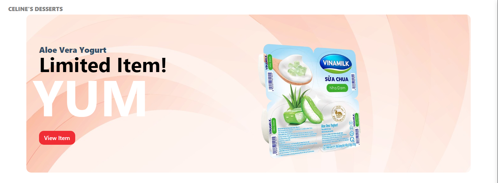

<!-- PROJECT LOGO -->
<br />
<h1>CELINE'S DESSERTS</h1>
<div align="center">
    
</div>

<!-- ABOUT THE PROJECT -->
## About The Project
<p>Memories is a MERN stack project and it is a social media app where user can make post, delete posts, and like posts. Currently, there is no user authentication function and it is being build at the moment using GoogleAuth.
The page is being deployed on <a href="https://socialmemories.netlify.app" target='_blank'>Netlify</a></p>

### Built With


<br />

<br />

<br />


<!-- GETTING STARTED -->
## Getting Started

You can either view this app using the deployment link or the follow the steps below to run it in your local environment.

### Prerequisites

* npm
  ```sh
  npm install npm@latest -g
  ```

### Installation

1. Clone the repo
   ```sh
   git clone https://github.com/github_username/repo_name.git
   ```
2. Install NPM packages
   ```sh
   npm install --legacy-peer-deps
   ```
3. Change the baseUrl in /client/src/api/index.js from Heroku to your localhost port for the backend
   ```js
   const API = axios.create({ baseURL: 'http://localhost:YOUR-PORT-NUMBER' });
   ```
4. Change the script of /server/package.json
   ```js
   "scripts": {
       "start": "nodemon index.js"
   }
   ```   
5. Run the back end server
   ```sh
   npm start
   ```
6. Run the front end page
   ```sh
   npm start
   ```
<!-- USAGE EXAMPLES -->
## Usage
To start using the social media page, you can fill in the form to the left with all the information and hit submit. The user can delete, like a post and edit a post that they recently published.
